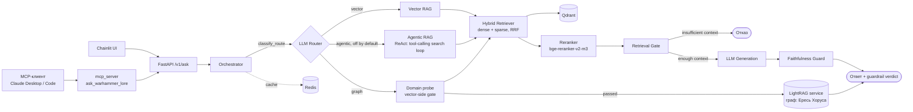
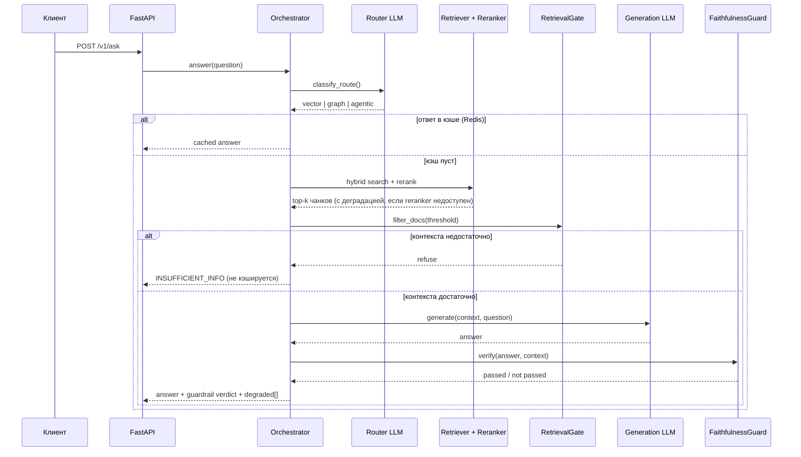

# RAG-система по лору Warhammer 40,000

[](https://github.com/KocheshkovAA/RAG/actions/workflows/ci.yml)


Гибридная RAG-система, отвечающая на вопросы по лору Warhammer 40k на русском языке, с роутингом между векторным и графовым retrieval и осознанным отказом от ответа вместо галлюцинации при низкой уверенности.

Это учебный проект для портфолио, а не продакшн-сервис — соответствующая честная оговорка есть в разделе [метрик](#метрики-и-эксперименты) и [ограничений](#известные-ограничения-и-планы): здесь нет попытки выдать 60 вопросов за статистически значимый бенчмарк.

### Проблема
Лор Warhammer 40k содержит:
- сложные причинно-следственные связи между событиями
- множество сущностей (фракции, персонажи, кампании)
- информацию, распределённую по разным источникам

Классический RAG плохо справляется с multi-hop вопросами и теряет связи между сущностями.

### Решение
Гибридная архитектура:
- классический RAG (hybrid retrieval + reranker) — для единичных фактов
- графовый retrieval (LightRAG) — для связей между сущностями и причинно-следственных цепочек
- LLM-роутер выбирает маршрут на лету, guardrails отказывают от ответа, если контекста недостаточно, вместо того чтобы галлюцинировать

#### Примеры запросов
Пример сложного запроса:
```
Почему Расколотые легионы (Железные Руки, Гвардия Ворона, Саламандры) продолжали действовать как координированная сила после Истваана V, и как их вмешательство в инцидент на Тассосе повлияло на кампанию Льва Эль'Джонсона на юге?
```

Пример простого запроса:
```
Как Чернокаменные крепости связаны с Абаддоном?
```

## Архитектура

### Компоненты



### Жизненный цикл запроса



Оба guardrail-а (`RetrievalGate`, `AnswerFaithfulnessGuard`) и circuit breaker-ы (`reranker`, `lightrag`, `tei`) — независимые компоненты, отказ одного не валит запрос целиком: система деградирует (например, отвечает без reranking) и явно помечает это полем `degraded` в ответе, а не падает или молчит об ухудшении качества.

## Что внутри
- **Фреймворк**: LangChain + LangGraph (последний — только там, где реально нужна нелинейная топология с общим состоянием, см. [«Дебаты персонажей»](#дебаты-персонажей))
- **Векторная БД**: Qdrant, hybrid search (dense + sparse BM25, RRF)
- **Embeddings**: TEI (Text Embeddings Inference) — Qwen3-Embedding-0.6B
- **Reranker**: vLLM — bge-reranker-v2-m3
- **LLM-провайдеры** — не завязаны на одного вендора, переключаются переменной окружения `LLM_PROVIDER` + per-role оверрайды, без изменения кода:
  - **self-hosted vLLM** (`vllm-llm`, Qwen3-4B-AWQ на локальном GPU) — полностью автономный путь без внешних API вообще;
  - **OpenRouter** — топовые модели без завязки на конкретного вендора;
  - **routerai.ru** (OpenAI-совместимый агрегатор с доступом к DeepSeek/Claude/GPT, работает из РФ) — используется для LLM-судьи в eval;
  - **GigaChat Pro / Lite** (через `gigachat-adapter`) — текущий дефолт для генерации в конфиге, легко переключается на любой из вариантов выше.
  - LLM-судья намеренно на другом провайдере/модели (DeepSeek через routerai), чем генерация по умолчанию (GigaChat) — так оценка не рискует получить предвзятость из-за самооценки.
- **API**: FastAPI, rate limiting (slowapi), NDJSON-стриминг для `/v1/debate`
- **Инфраструктура**: всё в Docker Compose; tracing/observability — Langfuse (`make debug-up`)
- **Оркестрация запросов**: LLM-роутер (vector / graph / agentic), guardrails, circuit breaker-ы с плавной деградацией

## MCP-сервер
Помимо HTTP API (`/v1/ask`), пайплайн обёрнут в MCP tool-сервер (`mcp_server/`) —
его можно подключить как инструмент к Claude Desktop, Claude Code и другим
MCP-клиентам, без прямых HTTP-вызовов. Внутри — тот же оркестратор с теми же
guardrails (retrieval gate, faithfulness check), просто вызванный агентно.
Поднимается вместе с основным стеком (`make up`, сервис `mcp-server`).

## Дебаты персонажей
Отдельный стриминговый эндпоинт `/v1/debate` (NDJSON, событие на строку) поверх LangGraph: три персонажа с разным голосом (Орк-Варбосс, Эльдарский Провидец, Космодесантник) по очереди пересказывают один и тот же вопрос в своей манере.

Ключевое инженерное решение — разделение факта и формы:
1. один нейтральный черновик ответа проходит faithfulness-проверку один раз;
2. персонажи только переигрывают уже верифицированный текст в своём голосе, видя реплики предыдущих участников раунда, но не имея возможности исказить факты.

Раньше faithfulness гонялась по разу на каждого стилизованного персонажа — стилизация (сленг, пафос) сбивала LLM-judge не хуже настоящей галлюцинации, и это стоило 3 LLM-вызовов вместо одного на тот же контекст. Это единственное место в проекте, где применяется LangGraph — обычный retry-цикл agentic-маршрута в графовом фреймворке не нуждается.

## LightRAG
Графовый retrieval для multi-hop вопросов. Используется, когда ответ требует:
- связей между фракциями
- исторических цепочек событий
- причинно-следственных зависимостей

> Граф построен только по одной статье («Ересь Хоруса», ~830 сущностей) — сознательное решение, чтобы не жечь токены на индексацию всей вики. Демо-вопросы на graph-маршруте стоит держать в рамках этой статьи (примархи, легионы, ключевые события Ереси) — за её пределами возможны ложные отказы (см. [ограничения](#известные-ограничения-и-планы)).

Полученный граф:


## Источник и подготовка данных
* Данные собирались с [Warhammer 40k Fandom](https://warhammer40k.fandom.com/ru/wiki/Warhammer_40000_Wiki) с помощью парсера на Python.
* Из текстов извлекаются источники для последующего использования.
* Тексты статей делятся на чанки на основе структуры документов (html).

## Метрики и эксперименты

> Датасет — 60 вручную размеченных вопросов (article_title + ключевые цитаты). Это ориентировочная выборка для быстрой итерации на учебном проекте, не статистически значимый бенчмарк (индустриальный минимум для риск-валидации — порядка 250–500 вопросов). Цифры ниже стоит читать как направление, а не как строгую метрику. Каждый прогон eval пишет JSON-файл с метаданными запуска рядом с результатами (провайдер/модель по ролям, git-хэш, датасет) — сравнения воспроизводимы.

### 1. Выбор би-энкодера
Первичный отбор моделей — по [MTEB leaderboard](https://huggingface.co/spaces/mteb/leaderboard), затем прогон на тестовом наборе и визуализация эмбеддингов на плоскости (`experiments/test_models.ipynb`).

### 2. Ретривер: влияние reranking
```
СРАВНЕНИЕ @5                 | Base       | Rerank     | Delta
----------------------------------------------------------------------------------------------------
citation_recall@5            | 0.673      | 0.817      |     +0.144
citation_precision@5         | 0.156      | 0.190      |     +0.034
```
```
Метрика                      @3         @5         @10        @20
----------------------------------------------------------------------------------------------------
citation_hit                 0.750      0.867      0.867      0.867
citation_recall              0.692      0.817      0.817      0.817
citation_precision           0.261      0.190      0.095      0.047
citation_mrr                 0.633      0.659      0.659      0.659
```

### 3. Vector vs Graph — retrieval и качество генерации по маршрутам
56 вопросов в рамках «Ереси Хоруса», каждый маршрут форсирован явно (`app/eval/evaluate_routes.py`). Метрики по article_title (title_hit/MRR) здесь не приводятся: граф построен по единственной статье, поэтому такое попадание тривиально и ничего не показывает.

| route  | citation_recall@5 | faithfulness | answer_relevance | context_relevance | refusal_rate | латентность | токены |
|--------|--------------------|--------------|--------------------|---------------------|--------------|-------------|--------|
| vector | 0.661              | 0.889        | 0.921              | 0.936               | 0.07         | 4.8 c       | 2938   |
| graph  | 0.750              | 0.855        | 0.896              | 0.900               | 0.04         | 20.5 c      | — *    |

\* LightRAG не отдаёт usage-статистику в общий трекер токенов — это дыра в измерении, а не факт про экономичность маршрута.

Graph (LightRAG) выигрывает у vector по citation_recall@5 внутри своей специализации — ожидаемо. Качество генерации сопоставимо на обоих маршрутах (faithfulness > 0.85, остальные оси > 0.89); у graph чуть ниже — синтез ответа из графового контекста немного сложнее для LLM, чем работа с плоскими чанками. Латентность у graph выше на порядок — запрос к отдельному LightRAG-сервису плюс сборка мультихоп-контекста дороже, чем прямой векторный поиск.

### 4. LLM-роутер: промпт vs LoRA-классификатор
| конфигурация                          | held-out accuracy |
|----------------------------------------|--------------------|
| Промпт-классификатор (baseline, прод)  | 96.30% (26/27)      |
| LoRA на Qwen3-4B (та же модель, что и `vllm-llm` в проде) | 100.00% (27/27) |

Единичный LLM-вызов не идеально детерминирован даже на `temperature=0` — точность промпт-классификатора на этом held-out сплите колебалась между прогонами (78–96%, см. [`docs/rnd-decision-log.md`](docs/rnd-decision-log.md)); числа выше — последний перепроверенный прогон, не среднее. LoRA обучена на 133 примерах (r=16, 3 эпохи) и в принципе подгружаема в уже работающий `vllm-llm` через `--enable-lora` без отдельного деплоя модели — но LoRA-роутер не задеплоен в проде: `R&D decision log` фиксирует это как `iterate`, не `kill` — точность подтверждена, продакшн-интеграция упирается в отдельный inference-путь, а не в сомнение в модели.

### 5. Capstone: полный пайплайн с реальной классификацией маршрута
60 вопросов идут через настоящий `classify_route()`, как в проде `/v1/ask` (`app/eval/evaluate_capstone.py`), а не с форсированным маршрутом:

| метрика | значение |
|---|---|
| распределение маршрутов | vector = 39, graph = 21 |
| faithfulness / answer_relevance / context_relevance / language_quality | 0.873 / 0.910 / 0.933 / 0.911 |
| латентность | 8.8 c (p95 22.7 c) |
| токены | 1887 |
| **refusal_rate** | **0.35** |

**Честная находка, а не баг**: все 21 вопрос, ушедших на graph-маршрут, получили отказ. Разбор показал, что промпт-роутер триггерится на реляционную формулировку («Как X связано с Y?») независимо от темы, хотя системный промпт требует оба условия сразу — «про Ересь Хоруса» И «сложный». Датасет — общие вопросы по лору, не про Ересь Хоруса конкретно, так что все 21 отказа корректны (LightRAG нарочно ограничен одной статьёй), но сигнализируют о слабой точности промпт-роутера вне типового сценария. LoRA-роутер (пункт 4) целится именно в эту проблему.

### 6. Дообучение би-энкодера — честный отрицательный результат
Дообученный чекпоинт поднят на GPU через `vLLM --runner pooling` (обход бага TEI с cuda-compat shim на GeForce) и переиндексировал весь корпус (59106 чанков). На игрушечном тестовом срезе (1500 кандидатов) дообучение давало NDCG@10 0.615 против 0.571 у baseline — на полном пайплайне (реальные 60 вопросов, vector/agentic маршруты) разница исчезает:

| сценарий                   | route   | title_hit@5 | MRR@5 | citation_recall@5 |
|-----------------------------|---------|-------------|-------|--------------------|
| baseline (TEI)               | vector  | 0.800       | 0.729 | 0.725              |
| baseline (TEI)               | agentic | 0.783       | 0.726 | 0.725              |
| finetuned (vllm-biencoder)    | vector  | 0.783       | 0.714 | 0.717              |
| finetuned (vllm-biencoder)    | agentic | 0.800       | 0.731 | 0.733              |

Вывод: дообучение биэнкодера не даёт устойчивого прироста на полной задаче поиска (разница в пределах шума), хотя сама инфраструктура (self-hosted GPU-инференс энкодера через vLLM вместо TEI) — рабочая и переиспользуемая находка сама по себе.

### Оценка генерации (LLM-as-a-Judge)
Отдельная модель (`WarJudge`) валидирует ответы по трём осям — **faithfulness** (штрафует галлюцинации), **answer_relevance**, **context_relevance** — плюс текстовая критика. Судья намеренно на другом провайдере/модели, чем генерация по умолчанию, чтобы не оценивать самого себя.

## Инженерные решения и их обоснование
Коротко — что и почему, а не просто «что реализовано»:

- **Guardrails отказывают, а не галлюцинируют.** `RetrievalGate` режет по порогу score, `AnswerFaithfulnessGuard` верифицирует финальный ответ LLM-судьёй в два независимых слоя (дословная цитата + отдельная entailment-проверка, что цитата подтверждает именно этот факт, не просто существует в контексте). Порог пропуска проверки калибруется по реальному распределению score reranker'а на корпусе (сейчас 0.72, не круглое число) — см. [`docs/rnd-decision-log.md`](docs/rnd-decision-log.md) про то, как обнаружился и чинился разрыв между заданным порогом и тем, что reranker физически способен выдать.
- **Routing по умолчанию — vector, graph только в рамках своего охвата.** Метрики (пункт 3 выше) подтверждают: graph выигрывает retrieval внутри своей специализации, но не оправдан для произвольных вопросов — отсюда узкий системный промпт роутера.
- **LightRAG — граф по одной статье, осознанно.** Полная индексация вики графом — вопрос токен-бюджета, не забытая доработка; расширение охвата — явный пункт плана, не скрытое ограничение.
- **LLM-судья — другой провайдер и модель, чем генерация.** Иначе eval рискует получить предвзятую самооценку, особенно вредно при оценке graph-маршрута, где ответы сложнее и легче получить одобрение «своего» стиля рассуждений.
- **Circuit breaker + плавная деградация вместо падения.** Реранкер, LightRAG, TEI обёрнуты в `call_with_circuit` — при сбое сервис деградирует (например, без reranking) и явно помечает это в ответе (`degraded`), а не роняет запрос.
- **Agentic-маршрут — узкий ReAct-скеффолдинг, не универсальный харнес.** Единственный инструмент (`search_knowledge_base`, read-only hybrid search), модель сама решает, сколько раз и с какими запросами его вызвать (включая параллельные вызовы на разные сущности за один ход), останов — по тому же `RetrievalGate`/`max_iterations`, что и у vector-маршрута. Guardrails переиспользуются по ссылке, не пересоздаются — агентность не может обойти пороги отказа. Подробная архитектура (state/control-flow/reasoning modes/stop conditions) — [`docs/agent-architecture.md`](docs/agent-architecture.md); ручная (без LangGraph/`bind_tools`) реализация того же паттерна — [`examples/minimal_agent_loop.py`](examples/minimal_agent_loop.py). Предсказуемый узкий пайплайн, совместимый с guardrails, а не свобода произвольных файловых/tool-операций общего харнеса (Claude Code/Codex-стиль) — осознанный компромисс, не недоделанная агентность.
- **LangGraph — только там, где реально нужна нелинейная топология.** Единственное применение — дебаты персонажей (несколько узлов-агентов с общим состоянием); обычный retry-цикл agentic-маршрута обходится без графового фреймворка.
- **Дебаты персонажей проверяют факты один раз, не трижды.** Стилизация текста под персонажа путает LLM-judge не хуже реальной галлюцинации — поэтому faithfulness гоняется по нейтральному черновику до стилизации, а не по каждому персонажу отдельно.
- **JSON-файл с метаданными вместо отдельной БД для eval-конфигов.** Каждому прогону eval нужно зафиксировать провайдер/модель/git-хэш — для одной такой записи выделенный Postgres-сервис избыточен, JSON-файл рядом с результатами дешевле и покрывает ту же задачу.
- **Нет привязки к одному LLM-вендору.** GigaChat, OpenRouter, routerai.ru и полностью self-hosted vLLM — переключаются переменной окружения, без правок кода.

## Известные ограничения и планы
Осознанные пробелы, а не скрытые баги:

- **Eval-датасет — 60 вопросов**, не статистически значимая выборка (индустриальный минимум — 250–500). Цифры показывают направление, не точную величину эффекта.
- **Промпт-роутер даёт ложные срабатывания** на реляционные формулировки за пределами охвата графа (пункт 5 выше) — LoRA-роутер (100% held-out accuracy на последнем прогоне) уже обучен и потенциально решает эту проблему точности, но не задеплоен: нужен отдельный inference-путь, не просто смена промпта.
- **`AnswerFaithfulnessGuard` калиброван на 10-вопросных выборках** во время последней серии правок (`docs/rnd-decision-log.md`) — юнит-тесты и regression-смоук-кейсы проходят стабильно, но нет adversarial-датасета с намеренно испорченными фактами: снижение строгости порога (all-or-nothing → score-порог) теоретически может пропустить ответ, где часть claims — настоящие галлюцинации, а не просто неидеально скопированные верные факты. Открытый риск, не закрытый экспериментально.
- **Дообученный би-энкодер не даёт измеримого прироста** на полном пайплайне (пункт 6 выше) — инфраструктура (vLLM pooling на GPU) сохранена как рабочая находка, замена модели отложена.
- **LightRAG-граф — одна статья.** Расширение охвата снимет искусственные границы демо-вопросов, но стоит токен-бюджета индексации.
- Лицензия для репозитория пока не выбрана.

## ▶️ Запуск

```bash
make up          # основной стек
make debug-up    # с Langfuse и дебагом
make down        # остановка
make eval        # оценка
make test        # быстрые guardrail-тесты (без Docker/LLM)
make smoke       # smoke-тесты живого /v1/ask
```

## Tracing
Для трейсинга и анализа пайплайна используется Langfuse.
Пример:

