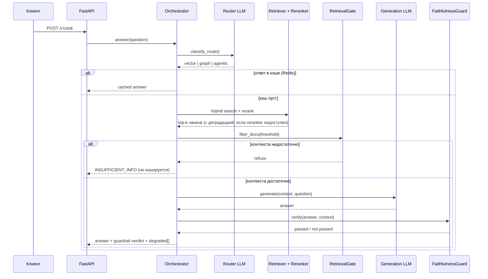
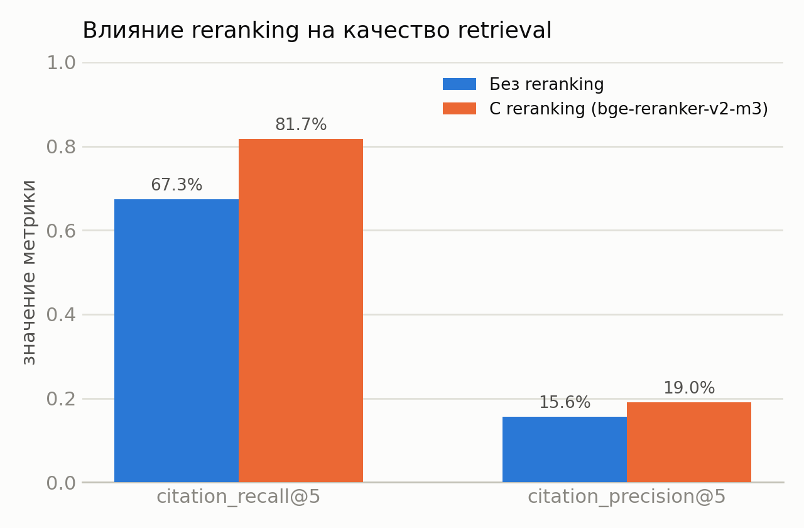
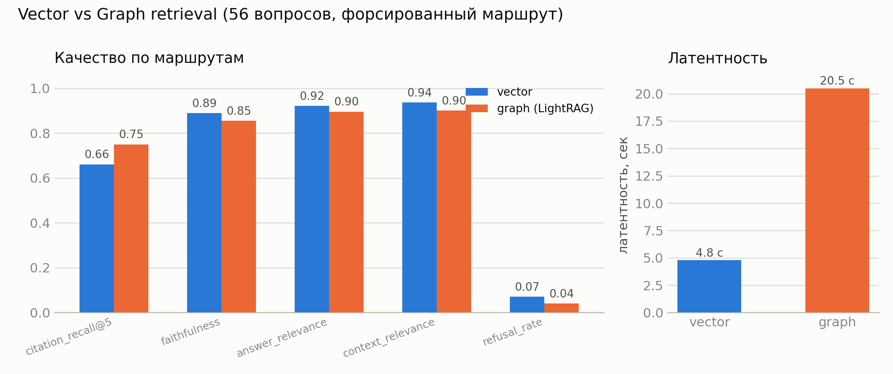
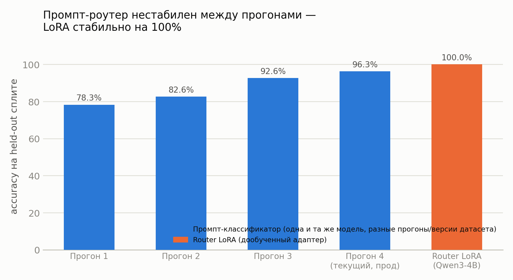
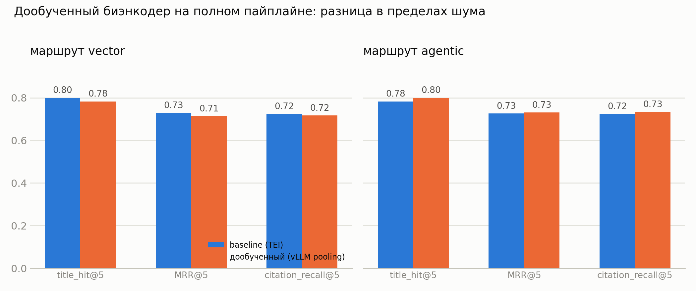

# RAG-система по лору Warhammer 40,000

[](https://github.com/KocheshkovAA/RAG/actions/workflows/ci.yml)


Гибридная RAG-система, отвечающая на вопросы по лору Warhammer 40k на русском языке, с роутингом между векторным и графовым retrieval и осознанным отказом от ответа вместо галлюцинации при низкой уверенности.

### Проблема
Лор Warhammer 40k содержит:
- сложные причинно-следственные связи между событиями
- множество сущностей (фракции, персонажи, кампании)
- информацию, распределённую по разным источникам

Классический RAG плохо справляется с multi-hop вопросами и теряет связи между сущностями.

### Решение
Гибридная архитектура:
- классический RAG (hybrid retrieval + reranker) — для единичных фактов
- графовый retrieval (LightRAG) — для связей между сущностями и причинно-следственных цепочек
- LLM-роутер выбирает маршрут на лету, guardrails отказывают от ответа, если контекста недостаточно, вместо того чтобы галлюцинировать

#### Примеры запросов
Пример сложного запроса:
```
Почему Расколотые легионы (Железные Руки, Гвардия Ворона, Саламандры) продолжали действовать как координированная сила после Истваана V, и как их вмешательство в инцидент на Тассосе повлияло на кампанию Льва Эль'Джонсона на юге?
```

Пример простого запроса:
```
Как Чернокаменные крепости связаны с Абаддоном?
```

## Архитектура

### Компоненты


### Жизненный цикл запроса



Оба guardrail-а (`RetrievalGate`, `AnswerFaithfulnessGuard`) и circuit breaker-ы (`reranker`, `lightrag`, `tei`) — независимые компоненты, отказ одного не валит запрос целиком: система деградирует (например, отвечает без reranking) и явно помечает это полем `degraded` в ответе, а не падает или молчит об ухудшении качества.

## Архитектура агента, security, R&D-дисциплина


- [`docs/agent-architecture.md`](docs/agent-architecture.md) — state, control flow, reasoning modes (CoT/ReAct/Reflection — что реализовано), tools, guards, stop conditions, memory/context management.
- [`docs/agent-threat-model.md`](docs/agent-threat-model.md) — prompt injection, tool misuse, зацикливание, hallucinated action, context poisoning.
- [`docs/rnd-decision-log.md`](docs/rnd-decision-log.md) — эксперименты в формате hypothesis → success criteria → experiment → metrics → decision .


## Что внутри
- **Фреймворк**: LangChain + LangGraph ([«Дебаты персонажей»](#дебаты-персонажей))
- **Векторная БД**: Qdrant, hybrid search (dense + sparse BM25, RRF)
- **Embeddings**: TEI (Text Embeddings Inference) — Qwen3-Embedding-0.6B
- **Reranker**: vLLM — bge-reranker-v2-m3
- **LLM-провайдеры** — не завязаны на одного вендора, переключаются переменной окружения `LLM_PROVIDER` + per-role оверрайды, без изменения кода:
  - **self-hosted vLLM** (`vllm-llm`, Qwen3-4B-AWQ на локальном GPU) — полностью автономный путь без внешних API вообще;
  - **OpenRouter** — модели без завязки на конкретного вендора;
  - **routerai.ru** (OpenAI-совместимый агрегатор) — используется для LLM-судьи в eval;
  - **GigaChat Pro / Lite** (через `gigachat-adapter`) — текущий дефолт для генерации в конфиге, легко переключается на любой из вариантов выше.
- **API**: FastAPI
- **Инфраструктура**: всё в Docker Compose; tracing/observability — Langfuse (`make debug-up`)
- **Оркестрация запросов**: LLM-роутер (vector / graph / agentic), guardrails

## MCP-сервер
Помимо HTTP API (`/v1/ask`), пайплайн обёрнут в MCP tool-сервер (`mcp_server/`) —
его можно подключить как инструмент к другим
MCP-клиентамв.

## Дебаты персонажей
Отдельный стриминговый эндпоинт `/v1/debate` (NDJSON, событие на строку) поверх LangGraph: три персонажа с разным голосом по очереди комментируют один и тот же вопрос в своей манере.
Разделение факта и формы:
1. один нейтральный черновик ответа проходит faithfulness-проверку один раз;
2. персонажи только переигрывают уже верифицированный текст в своём голосе, видя реплики предыдущих участников раунда, но не имея возможности исказить факты.

## LightRAG
Графовый retrieval для multi-hop вопросов. Используется, когда ответ требует:
- связей между фракциями
- исторических цепочек событий
- причинно-следственных зависимостей

Полученный граф:


## Источник и подготовка данных
* Данные собирались с [Warhammer 40k Fandom](https://warhammer40k.fandom.com/ru/wiki/Warhammer_40000_Wiki) с помощью парсера на Python.
* Из текстов извлекаются источники для последующего использования.
* Тексты статей делятся на чанки на основе структуры документов (html).

## Метрики и эксперименты

### 1. Выбор би-энкодера
Первичный отбор моделей — по [MTEB leaderboard](https://huggingface.co/spaces/mteb/leaderboard), затем прогон на тестовом наборе и визуализация эмбеддингов на плоскости (`experiments/test_models.ipynb`).

### 2. Ретривер: влияние reranking


```
Метрика                      @3         @5         @10        @20
----------------------------------------------------------------------------------------------------
citation_hit                 0.750      0.867      0.867      0.867
citation_recall              0.692      0.817      0.817      0.817
citation_precision           0.261      0.190      0.095      0.047
citation_mrr                 0.633      0.659      0.659      0.659
```

### 3. Vector vs Graph — retrieval и качество генерации по маршрутам



| route  | citation_recall@5 | faithfulness | answer_relevance | context_relevance | refusal_rate | latency | токены |
|--------|--------------------|--------------|--------------------|---------------------|--------------|-------------|--------|
| vector | 0.661              | 0.889        | 0.921              | 0.936               | 0.07         | 4.8 c       | 2938   |
| graph  | 0.750              | 0.855        | 0.896              | 0.900               | 0.04         | 20.5 c      | 12137    |

Graph (LightRAG) выигрывает у vector по citation_recall@5 внутри своей специализации — ожидаемо. Качество генерации сопоставимо на обоих маршрутах (faithfulness > 0.85, остальные оси > 0.89); latency у graph выше на порядок — запрос к отдельному LightRAG-сервису плюс сборка мультихоп-контекста дороже, чем прямой векторный поиск.

### 4. LLM-роутер: промпт vs LoRA-классификатор


| конфигурация                          | held-out accuracy |
|----------------------------------------|--------------------|
| Промпт-классификатор (baseline, прод)  | 96.30%       |
| LoRA на Qwen3-4B (та же модель, что и `vllm-llm` в проде) | 100.00%  |

LoRA обучена на 133 примерах (r=16, 3 эпохи) и в принципе подгружаема в уже работающий `vllm-llm` через `--enable-lora` без отдельного деплоя модели — но LoRA-роутер.

### 5. Дообучение би-энкодера
Дообученный чекпоинт поднят на GPU через `vLLM --runner pooling` (обход бага TEI) и переиндексировал весь корпус (59106 чанков). На тестовом срезе дообучение давало NDCG@10 0.615 против 0.571 у baseline — на полном пайплайне  разница исчезает:



| сценарий                   | route   | title_hit@5 | MRR@5 | citation_recall@5 |
|-----------------------------|---------|-------------|-------|--------------------|
| baseline (TEI)               | vector  | 0.800       | 0.729 | 0.725              |
| baseline (TEI)               | agentic | 0.783       | 0.726 | 0.725              |
| finetuned (vllm-biencoder)    | vector  | 0.783       | 0.714 | 0.717              |
| finetuned (vllm-biencoder)    | agentic | 0.800       | 0.731 | 0.733              |

Вывод: дообучение биэнкодера не даёт устойчивого прироста на полной задаче поиска (разница в пределах шума).

### Оценка генерации (LLM-as-a-Judge)
Отдельная модель валидирует ответы по трём осям — **faithfulness** (штрафует галлюцинации), **answer_relevance**, **context_relevance** — плюс текстовая критика. Судья намеренно на другом провайдере/модели.

## ▶️ Запуск

```bash
make up          # основной стек
make debug-up    # с Langfuse и дебагом
make down        # остановка
make eval        # оценка
make test        # быстрые guardrail-тесты (без Docker/LLM)
make smoke       # smoke-тесты живого /v1/ask
```

## Tracing
Для трейсинга и анализа пайплайна используется Langfuse.
Пример:

