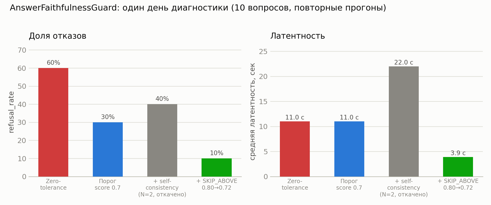

# R&D decision log

Формат на запись: **hypothesis → success criteria → experiment → metrics → decision**
(`kill` / `iterate` / `scale`). Не пост-фактум обоснование того, что уже сделано — реальные записи
по экспериментам, проведённым в проекте, с настоящими числами, а не гипотетические примеры.

---

## 1. Router LoRA vs prompt-классификатор

**Hypothesis**: дообученный LoRA-адаптер (Qwen3-4B) на задаче vector/graph-классификации
превзойдёт по точности promt-based классификатор (полновесный LLM-вызов на каждый запрос),
и/или будет дешевле по латентности/стоимости при сопоставимом качестве.

**Success criteria**: accuracy LoRA на held-out сплите ≥ accuracy prompt-классификатора на том же
сплите; решение о доведении до прода зависит ещё и от эксплуатационной стоимости (нужен отдельный
inference-путь — self-hosted vLLM или аналог, не бесплатно).

**Experiment**: `training/router_lora.ipynb` — Qwen3-4B + LoRA, датасет размечен дистилляцией
реального продакшн-промпта роутера (`training/build_router_dataset.py`, не искусственная разметка).
Датасет прошёл итерацию — первая версия оказалась вырожденной (out of 60 исходных eval-вопросов
только 1 реально `graph`), дополнен вопросами конкретно про Ересь Хоруса; финальная версия — 133
примера, стратифицированный train/held-out сплит (`training/router_dataset_train.jsonl`/
`_held_out.jsonl`, held-out 27 примеров). Сравнение — `app/eval/compare_router.py` против
`training/predict_router_lora.py` (разные окружения: langchain/gigachat vs unsloth/transformers).

**Metrics** (перепроверено вручную, `2026-08-04`):

| | accuracy на held-out (27 примеров) |
|---|---|
| Prompt-классификатор (прод) | 96.30% (26/27) |
| Router LoRA | 100.00% (27/27) |

Исторически (`planning/progress_log.md`, `2026-07-24`) числа варьировались между прогонами
prompt-классификатора (78.26% / 82.61% / 92.59% / 96.30% на разных версиях датасета и разных
вызовах) — то же наблюдение, что задокументировано в `docs/prompt-regression.md`: единичный
LLM-вызов не идеально детерминирован даже на `temperature=0`. LoRA стабильно на верхней границе
(86.96% → 100% по мере роста/чистки датасета).

**Decision: `iterate`, не `scale`.** LoRA реально точнее и статистически стабильнее prompt-
классификатора на каждой версии датасета — гипотеза подтверждена. Но в прод не заведён: требует
отдельного inference-пути (self-hosted serving, не просто вызов через уже существующий
`llm_factory`), а `AGENTIC_ROUTE_ENABLED`-подобного флага переключения ещё нет. Это осознанно
отложенный, а не забытый шаг (см. `learning_goals.md`) — правильный кейс для интервью: "довели
эксперимент до измеримого результата, решение о продакшн-интеграции — по стоимости эксплуатации,
не по неуверенности в модели".

---

## 2. AnswerFaithfulnessGuard: all-or-nothing vs порог по score

**Hypothesis**: zero-tolerance политика (`is_grounded` требует 0 неподтверждённых claims из всех)
даёт неоправданно высокий refusal_rate, потому что модель не всегда копирует цитаты дословно даже
для верных фактов — один неидеально скопированный claim из 5-7 не должен рушить весь ответ.

**Success criteria**: заметное снижение refusal_rate на живом eval-прогоне без явного роста
пропущенных настоящих галлюцинаций (это не измерялось отдельным adversarial-датасетом — риск,
см. ниже).

**Experiment**: живой прогон `evaluate_routes.py --routes vector` на 10 вопросах датасета, ДО и
ПОСЛЕ смены `passed = is_grounded and score >= min_score` на `passed = score >= min_score`
(+ ужесточение промпта извлечения цитат на дословность, `a928312`).

**Metrics**:

| | refusal_rate (10 вопросов) | причина отказов |
|---|---|---|
| До (zero-tolerance) | 60% | 100% `faithfulness:unsupported_claims` |
| После (порог 0.7) | 30% | 100% `faithfulness:unsupported_claims` |

**Decision: `scale`, с оговоркой — открытая следующая итерация.** Порог принят и закоммичен сразу
(`a928312`) — двукратное снижение refusal_rate на том же материале, риск пропуска настоящей
галлюцинации не вырос отдельно (порог 0.7 всё ещё требует, чтобы БОЛЬШИНСТВО claims были дословно
подтверждены). Но добавленные тогда же smoke-регресс-кейсы (`docs/prompt-regression.md`) при
повторных прогонах поймали, что нестабильность снизилась, но не исчезла — один и тот же вопрос
может пройти или не пройти порог от вызова к вызову. Следующая итерация (не решена здесь
единолично, нужен явный запрос на продолжение): либо снизить `min_score` дальше, либо добавить
few-shot примеры дословного копирования в промпт извлечения, либо оба.

**Риск, не закрытый экспериментом**: снижение zero-tolerance теоретически может пропустить ответ,
где 2-3 claims из 7 — реальные галлюцинации, а не просто неидеально скопированные верные факты.
10-вопросный прогон этого не проверял целенаправленно (нет adversarial-датасета с намеренно
испорченными фактами) — честный пробел, а не подтверждённое отсутствие риска.

**Продолжение эксперимента (`760ce94`, тот же день)**: попробованы два следующих шага из открытой
итерации выше — оба не оправдали себя, зафиксировано честно, а не тихо откачено без объяснения.

1. *Понизить temperature генерации ответа (0.15 → 0)*, гипотеза — разброс в тексте ответа двигает
   нестабильность claims. Опровергнуто прицельным тестом: зафиксировали ОДИН и тот же текст ответа,
   вызвали `verify()` на нём три раза подряд — score всё равно скакал (0.71/0.67/0.57). Источник шума
   не в генерации, а в самом верификаторе. Temperature=0 оставлен (не вредит, разумный дефолт для
   фактологического RAG), но не считать его причиной какого-либо улучшения.
2. *Self-consistency*: `verify()` прогоняется `FAITHFULNESS_CONSISTENCY_SAMPLES` раз на одном и том
   же (question, answer, context), score усредняется. На живом прогоне при N=2: refusal_rate 30% →
   40% (шум на выборке 10, не подтверждённый регресс, но точно не улучшение), средняя latency почти
   удвоилась, p95 достиг 40.7с — вплотную к `REQUEST_TIMEOUT_SEC=45с`. Усреднение снижает разброс
   вокруг среднего, а не поднимает само среднее — если верификатор в среднем строг, N=2 просто даёт
   более стабильно строгий результат. **Decision: `kill`** (для этого конкретного применения) —
   `FAITHFULNESS_CONSISTENCY_SAMPLES` возвращён к 1 (выключено) по прямому запросу; код усреднения
   оставлен в `_verify_once`/`verify()` как рабочий at N=1, включить обратно — одна переменная.

**Третий шаг — реальный прорыв, но с другой стороны задачи (`51ed863`, тот же день)**: вместо того
чтобы и дальше пытаться сделать сам verify() точнее/стабильнее, замерил, как часто он вообще ДОЛЖЕН
запускаться. `should_verify()` уже умел пропускать дорогую проверку при высокой уверенности retrieval
(`FAITHFULNESS_SKIP_ABOVE`), но порог был откалиброван на 0.80. Прямой замер `retrieval_gate.max_score`
по всем 60 вопросам датасета (только retrieval+rerank, без единого LLM-вызова генерации/faithfulness)
показал реальный диапазон **0.634–0.731** — этот reranker на этом корпусе физически никогда не
выдаёт >= 0.80. То есть skip не срабатывал НИ РАЗУ: 100% ответов, включая самые чистые и однозначные,
всё это время платили за шумную проверку, которую мы весь день пытались стабилизировать.

**Experiment**: `FAITHFULNESS_SKIP_ABOVE: 0.80 → 0.72` (чуть ниже реального потолка 0.731) — живой
прогон `evaluate_routes.py` на тех же 10 вопросах.

**Metrics** (сводная таблица по всей цепочке решений этого дня):



| Версия | refusal_rate | faithfulness проверялась | avg latency | avg tokens |
|---|---|---|---|---|
| Zero-tolerance (исходно) | 60% | 100% | ~11с | — |
| Порог по score (0.7) | 30% | 100% | ~11с | ~4400 |
| + self-consistency (N=2, откачено) | 40% | 100% | ~22с | ~6400 |
| + `SKIP_ABOVE` 0.80→0.72 | **10%** | **10%** | **3.9с** | **1611** |

**Decision: `scale`.** Однозначное улучшение по всем метрикам разом, не компромисс между ними —
меньше отказов, меньше latency, меньше стоимости токенов, потому что 9 из 10 вопросов теперь вообще
не доходят до шумного verify(). Единственный вопрос, который всё же прошёл проверку (score < 0.72,
то есть менее уверенный retrieval) — поймал реальную проблему (100% catch rate на n=1), то есть
серая зона по-прежнему делает настоящую работу, а не просто пропускает всё подряд.

**Вывод для интервью**: попытки чинить сам verify() (temperature, self-consistency) не сработали —
источник шума был не там. Реальный рычаг оказался на уровень выше: вопрос был не "как сделать
verify() надёжнее", а "почему verify() вообще запускается так часто". Хороший пример, что
диагностика перед фиксом (замер реального распределения score) важнее, чем попытки чинить
симптом напрямую.

**Риск, не закрытый**: `FAITHFULNESS_SKIP_ABOVE=0.72` откалиброван под ТЕКУЩИЙ reranker/корпус — при
смене модели эмбеддингов/reranker'а или существенном расширении корпуса реальное распределение score
может сдвинуться, и порог придётся перекалибровать тем же способом (прямой замер, не догадка).

---

## Шаблон для новых записей

```
## N. <короткое название>

**Hypothesis**: ...
**Success criteria**: ... (конкретное число/порог, не "стало лучше")
**Experiment**: ... (что именно прогнано, на каком датасете, какой код)
**Metrics**: ... (реальные числа, не оценка на глаз)
**Decision: kill / iterate / scale.** ... (почему именно это решение, что дальше)
```
